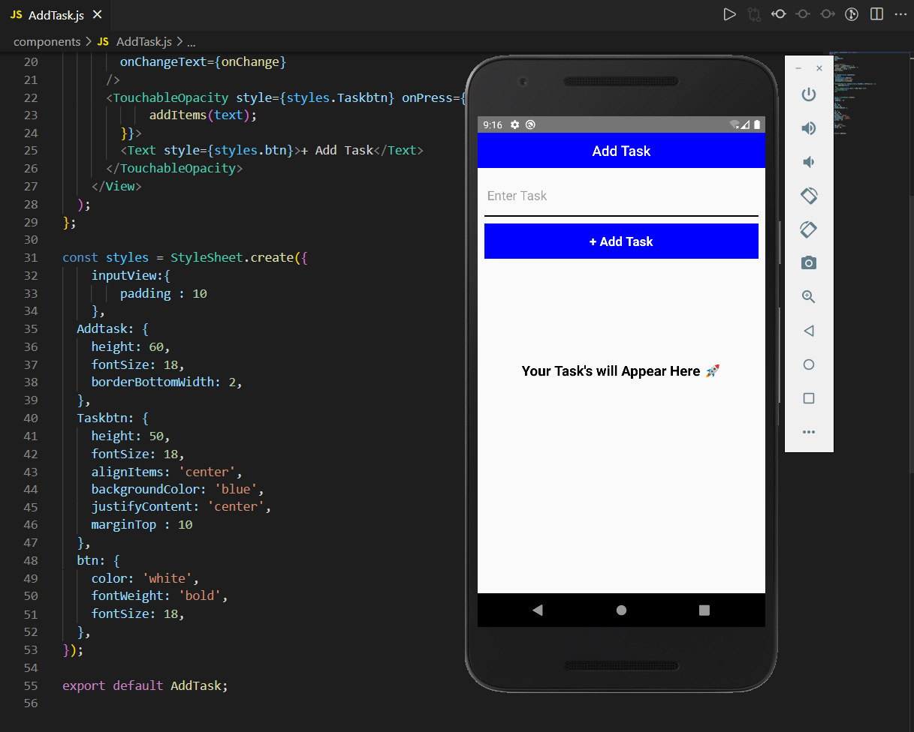
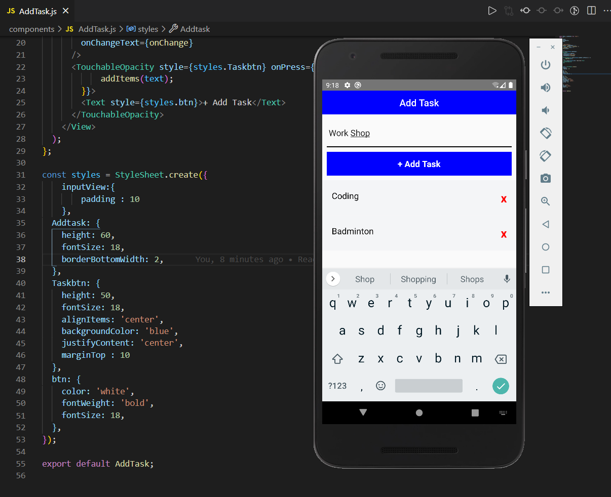
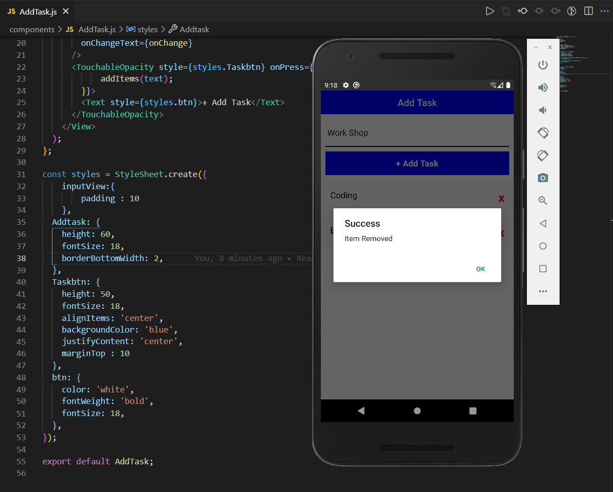

# To Do App

### Built in React Native 🚀

<br />

# Screenshots

* ## Welcome Screen


<br />

* ## Add Tasks


<br />

* ## Remove Tasks


<br />
<br />

# Development Setup

Clone the repository and run the following commands:
```shell
npm install
npm start
npm run android (for android)
npm run ios (for ios)
```

